# 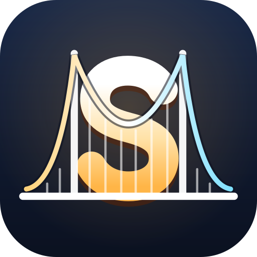 SPAN: Bridge Builder

### ▶ [Play SPAN in your browser](https://athraen.github.io/SpanGame/)
Free, no install. Works on desktop, tablet and phone, and can be installed as an app that plays offline.

**Build a bridge, send the traffic across, and watch real physics decide whether it holds.**

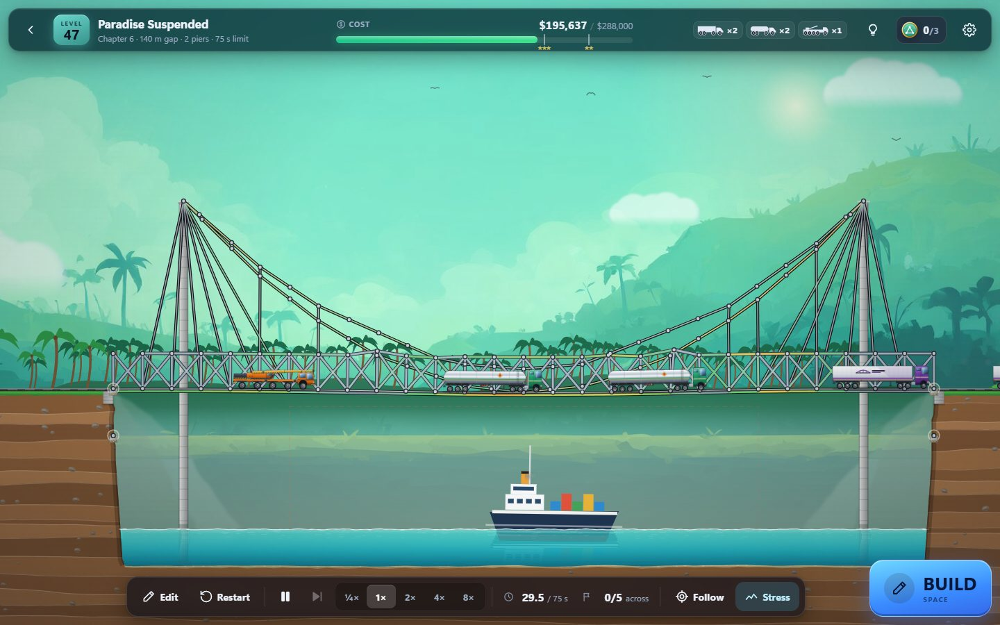

SPAN is a physics bridge-construction puzzle game. You build a bridge across a gap from road, wood, steel, rope and cable, stay under budget, then press **Test** to watch cars, buses and 60-tonne haulers drive across. Every member carries tension, compression and bending. If the bridge is too weak it sags, beams snap, and the bus ends up in the river. On the **Iron Road** you build railway viaducts instead, and a badly laid track derails the train.

It is plain HTML, CSS and JavaScript: no build step, no frameworks, no runtime dependencies. Open `index.html` and it runs, even straight from `file://`.

- **90 hand-made levels** in three campaigns: Roads (with two hidden bonus chapters), the Iron Road railway campaign and Famous Bridges.
- **A new crossing every day**, the same for everyone, plus an Endless mode. Every generated level is proven solvable before you see it.
- **Plays anywhere:** mouse and keyboard, or touch on phones and tablets. Install it as an app and it works offline.

## Contents

- [Feature tour](#feature-tour)
- [Play on your phone or tablet](#play-on-your-phone-or-tablet)
- [How to play](#how-to-play)
- [Controls](#controls)
- [Campaigns](#campaigns)
- [Install and offline play](#install-and-offline-play)
- [Running it locally](#running-it-locally)
- [Tests](#tests)
- [Project structure](#project-structure)
- [Documentation](#documentation)
- [Roadmap](#roadmap)
- [Contributing](#contributing)
- [Credits](#credits)
- [License](#license)

## Feature tour

### Build it

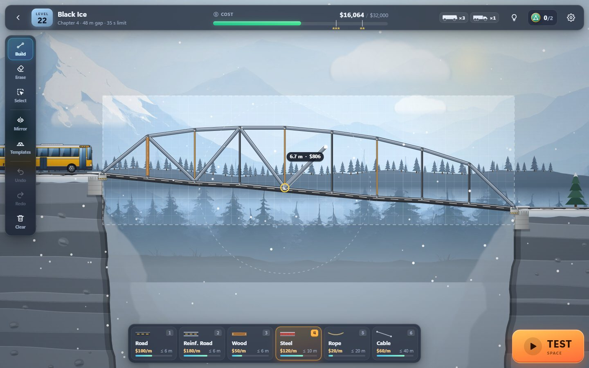

Pick a material from the palette and drag from an anchor or a joint. Beams snap to a grid and to nearby joints, and stop at the material's maximum length. Building chains on from the end of the last beam. There is mirror building, select / move / delete, undo / redo, piers that can rise into towers, and nine bridge templates (beam, Warren, Pratt and Howe trusses, deck and through arches, suspension, cable-stayed, viaduct) to start from. The **Arch & Curve tool** (`A`) lays a properly rounded arch or a hanging suspension cable in one gesture: drag from start to end, move up or down to set the rise, click. It picks the segments, keeps the joints on the grid, and can add the posts or hangers down to the deck for you; **Smooth** tidies an arch you built by hand. The cost bar shows how close you are to the budget and to the two- and three-star thresholds.

### Test it, and watch it fail

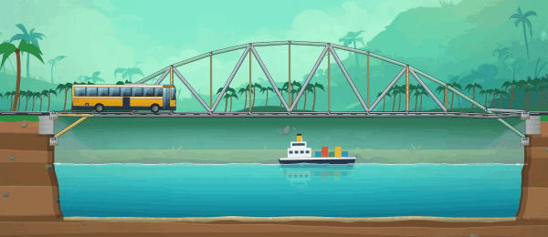

Press **Test** and the traffic drives across. The simulation is an XPBD solver running at 60 steps a second with 30 substeps each. It is deterministic, so a design that passes in the headless verifier passes in your browser too. Members are tinted from white through yellow to red as they load up, and they snap when they are overloaded. The results name the first member that gave way and why ("pulled apart in tension"), and **Inspect** shows the peak stress every member reached, so you know what to trim and what to reinforce.

### Railroads: the Iron Road campaign

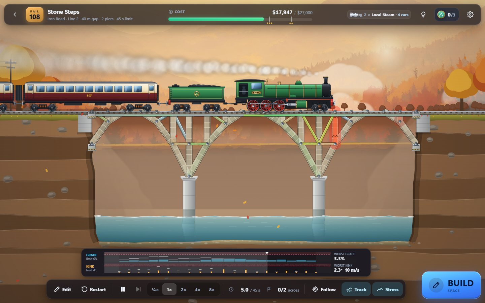

Twenty railway levels (101–120) open after road level 10, in four lines:

| Line | Levels | Trains | What you learn |
|---|---|---|---|
| Branch Lines | 101–105 | handcar, tram, local steam | lay track that a bogie can follow; trusses under the track |
| Stone & Steam | 106–110 | local steam, steam express | masonry arches and viaducts that stay in compression |
| Freight Corridor | 111–115 | commuter, long freight, 2000 t ore | the whole span loaded at once; deep trusses and box girders |
| High Speed | 116–120 | high-speed sets at 42 m/s (150 km/h) | dips that only a fast train notices; a double-deck road + rail finale |

Trains have locomotives, tenders, coaches and wagons on separate bogies, coupled with slack, with steam plumes, diesel exhaust, signals and catenary. The track adds three new materials: **rail** (the only deck trains ride on), **masonry** (cheap and immensely strong in compression, but it cracks when pulled and glows red to show it) and the heavy steel **box girder**.

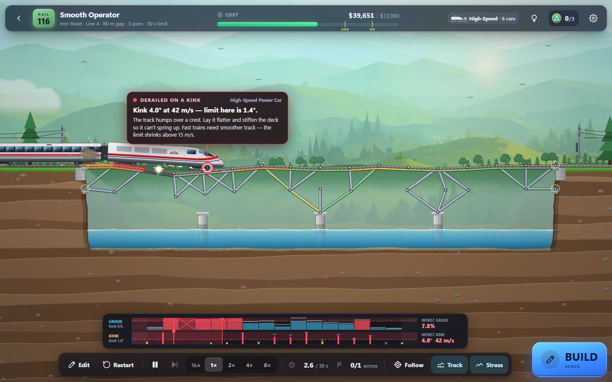

**Trains derail.** A train leaves the rails on a kink between track segments, a grade that is too steep, a broken or missing rail, or a bogie lifted off a crest. The kink limit is 4° and shrinks above 15 m/s, so a dip a steam train rolls over will throw a high-speed set off the track. When a train derails the action drops into slow motion, the offending wheel and rail joint pulse red, and a callout explains the cause with numbers. A **track recording** strip under the scene plots the grade and kink at every rail joint against the limits while the train runs. The results grade the ride from A to F.

### Famous Bridges

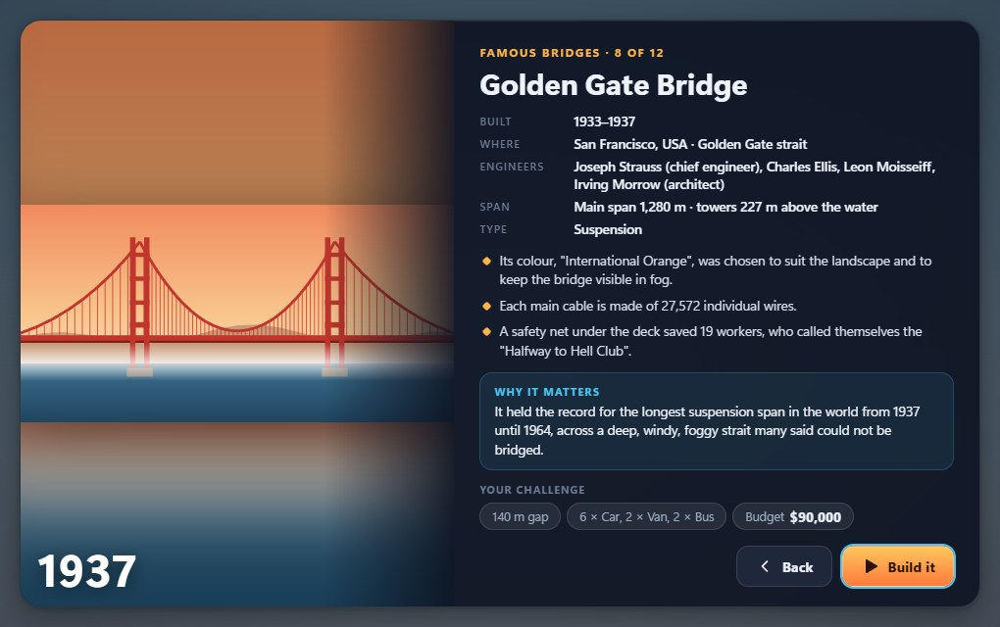

Twelve real crossings, scaled down but faithful, from the Pont du Gard to the Golden Gate, the Forth Bridge, Tacoma Narrows and the Millau Viaduct. Each keeps the real bridge's proportions, pier positions and kind of traffic, and is set up so that the historical structural type is the natural answer. A history card opens before each level: who built it, when, and why the engineers chose that shape.

### Forces of Nature

| Earthquake | Hurricane |
|---|---|
| 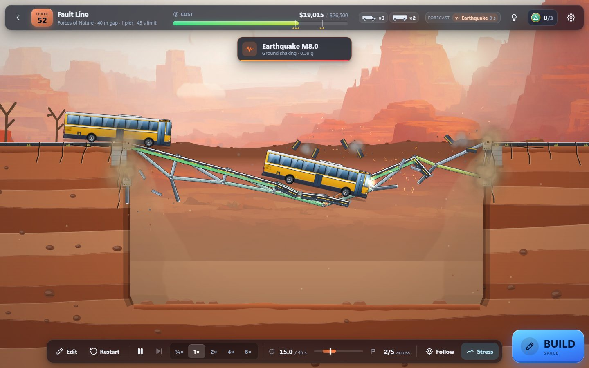 | 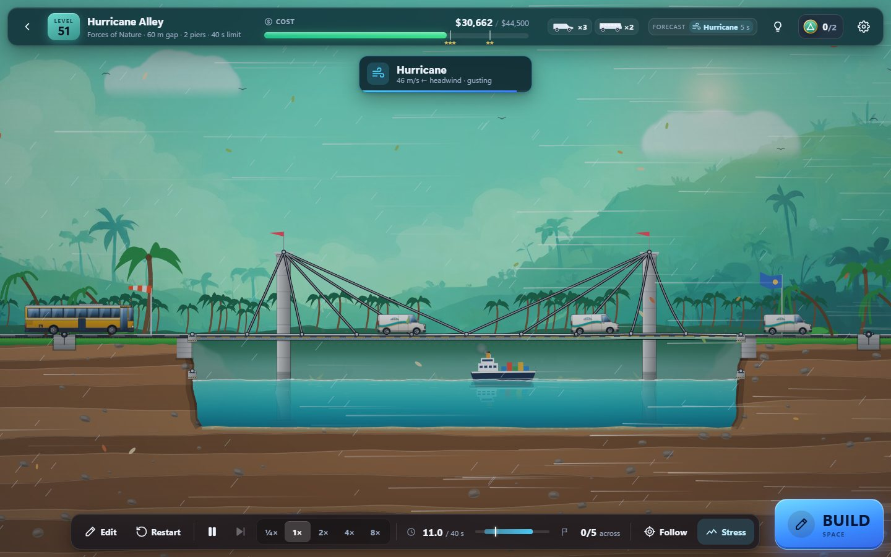 |

Finishing the Roads reveals a bonus chapter where the weather fights back: a hurricane that lifts light decks, an M8 earthquake whose ground wave reaches the far bank later than the near one, and a resonant wind that makes a slender suspension deck gallop apart, as the Tacoma Narrows Bridge did in 1940. A forecast chip lists what is coming and a banner counts it down. A second bonus chapter, **Anchorages**, is about land pylons, buried deadman anchors and backstays.

### Daily Challenge and Endless

| Today's crossing | Share your result |
|---|---|
| 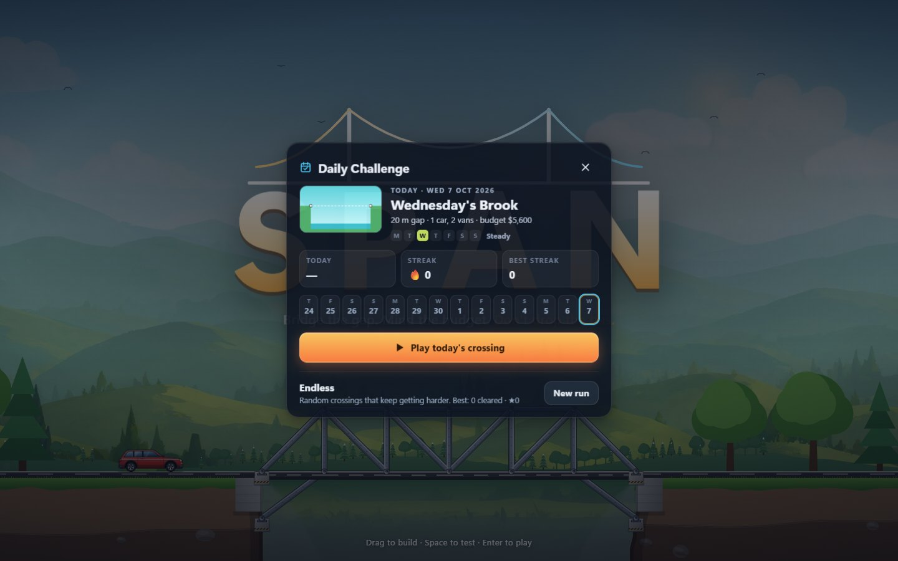 | 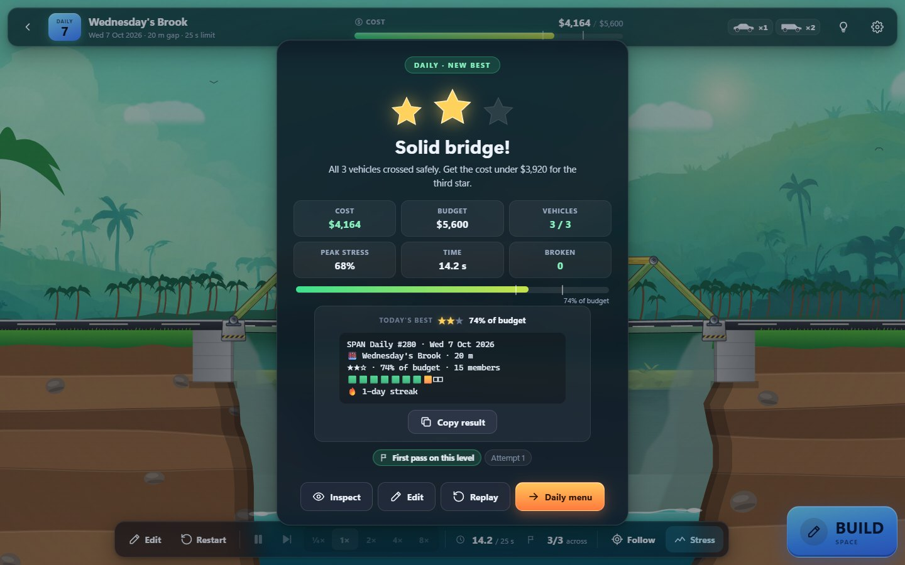 |

A new generated crossing every day, the same for everyone in every browser, from a gentle Monday to a brutal Sunday. Keep a streak, replay the last 14 days as practice, and copy a spoiler-free result to share. **Endless** keeps generating harder crossings. The generator builds and simulates its own bridge before it hands you a level, so every crossing is proven solvable, and its own design earns two stars: three stars means you beat the machine.

### Stars, badges and history

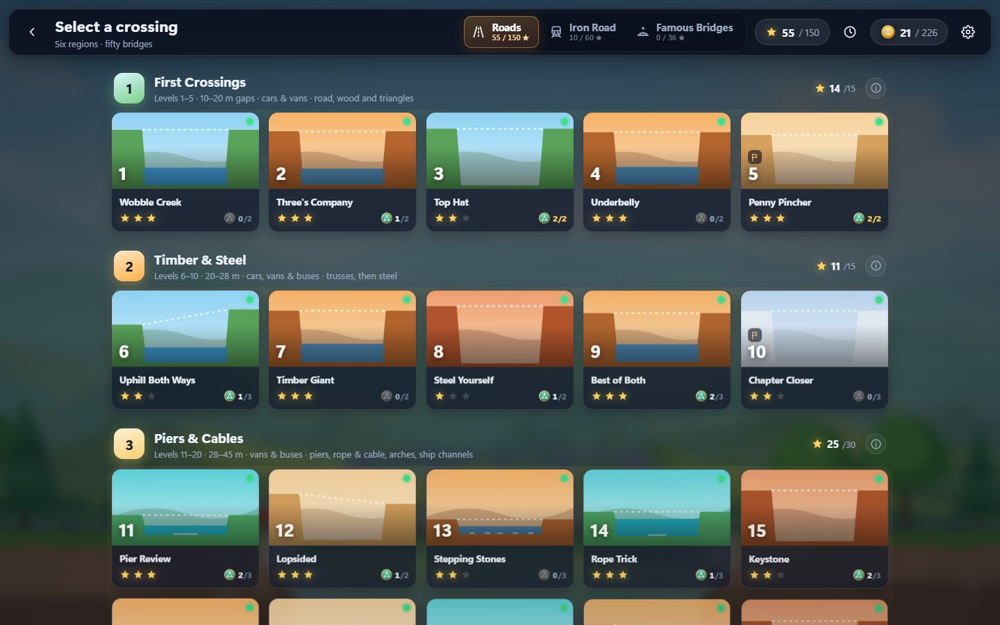

Each level awards up to three stars for staying under budget, plus two or three optional **challenge badges** (Minimalist, Penny Pincher, Featherweight, Cool Head, Symmetric, No Steel, Timber Only, No Piers, Smooth Ride). Every badge is proven achievable with a saved design. Every test run is recorded: personal bests per level, a cost sparkline, lifetime stats, one-tap loading of any earlier design, autosave and resume, and save export / import.

## Play on your phone or tablet

| Building by touch | A train crossing, phone held sideways |
|---|---|
| 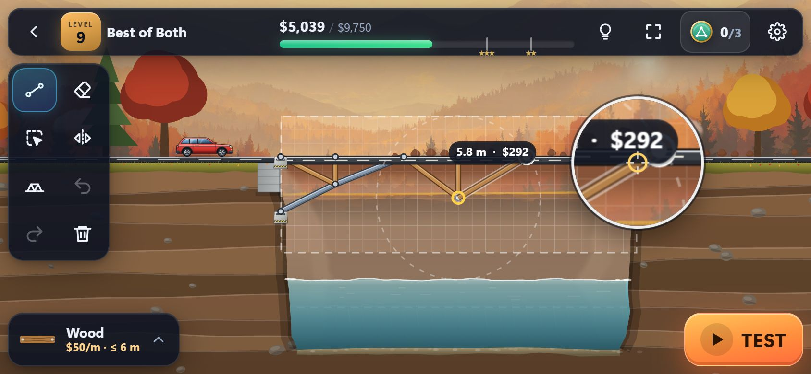 | 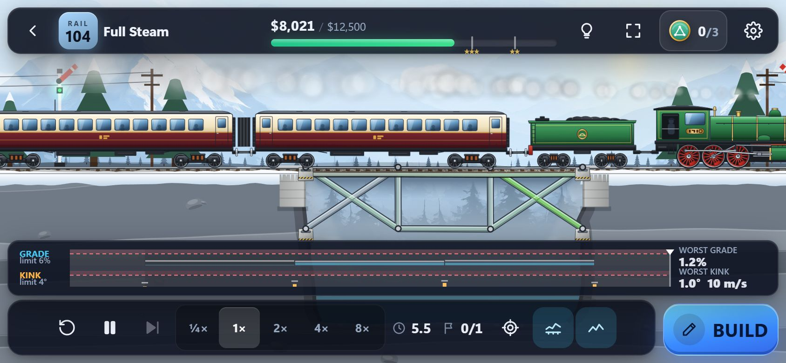 |

SPAN is built for touch as well as for the mouse, and every mode works on a phone: all three campaigns, the editor, the daily challenge, history and settings.

- **Touch building:** drag from a joint to build. A **magnifier** shows the spot under your finger, and an optional offset cursor aims above it. Tap a joint to build from it, hold and drag to move a joint, hold and lift for a menu (delete, stop building, undo, fit view). Pinch to zoom, drag empty space or use two fingers to pan.
- **Layouts for phones and tablets:** on a phone the top bar is compact, the tools float at the side and the materials sit in a bottom sheet behind the current-material chip. Tablets get the full palette. Portrait works; landscape gives the bridge more room.
- **Comfort:** haptic feedback on build and break, fullscreen, and a performance mode (Auto / On / Off) that trims particles, background layers and pixel density on slower devices.
- **Install it as an app:** open the game in Chrome or Edge on Android and press **Install SPAN** in Settings, or on iPhone / iPad tap **Share → Add to Home Screen**. It opens full-screen like a native app.
- **Play offline:** after the first visit every game file is cached on the device. All campaigns, the daily challenge (generated on the device) and endless mode, history and your saved progress then work with no connection, on a plane or underground.

## How to play

1. **Pick a crossing** on the level select. A level opens once either of the two levels before it is complete, so one hard crossing can be skipped and revisited. Chapter finales can't be skipped.
2. **Read the gap.** The top bar shows the cost against the budget (with the ★★★ and ★★ marks) and the traffic waiting to cross. The dashed rectangle is the build area; hatched zones are off limits (ship channels, for example) and yellow-striped bands are where piers may stand. Only piers and anchors may go below the waterline.
3. **Build.** **Road** and **reinforced road** are what vehicles drive on, and the road must run from bank to bank. A deck bends at its joints, so it needs a support (a strut, hanger or chord) about every 5–6 m. **Wood** and **steel** are structural members; **rope** and **cable** only carry tension. On railway levels the deck is **rail**, and trains need it laid smooth.
4. **Test** (Space). Watch the stress colours. Hover a member to see its force and stress.
5. **Optimise.** After a run, **Inspect** shows the peak stress each member reached. Trim the members that stay white or green, reinforce the red ones, and get the cost down for more stars.

**Pass** means every vehicle reaches the far bank within the time limit and the cost is within budget. ★★ needs a cost at or below 85 % of the budget, ★★★ at or below 70 % (on the Iron Road, ★★★ also needs every member intact). A run fails when a vehicle falls, when a vehicle is launched across instead of driving (a ramp is not a bridge), when a train derails, or when the traffic is stuck.

More detail on the rules, the badges, the daily challenge and every level is in [docs/GAMEPLAY.md](docs/GAMEPLAY.md).

## Controls

### Mouse and keyboard: building

| Input | Action |
|---|---|
| Drag from a joint | Build a beam (building chains on from its end; reaching an anchor ends the chain) |
| `Shift` while dragging | Fine snap (0.25 m) |
| `Ctrl`/`Alt`+drag a joint, or long-press then drag | Move a joint; drop it on another joint to merge them |
| Right-click / `E` | Erase (click or drag-sweep) |
| `B` / `P` / `S` | Build tool / pier tool / select tool (`Delete` removes the selection, `Ctrl+A` selects all) |
| `1`–`6` | Choose a material (in palette order) |
| `A` | Arch & Curve tool: drag start to end, release, move up/down for the rise, click to place; `+`/`−` or wheel = segments, `Esc` / right-click cancels |
| `M` | Mirror symmetry around the middle of the gap |
| `Ctrl+Z` / `Ctrl+Y` (or `Ctrl+Shift+Z`) | Undo / redo |
| `G` / `H` | Goals panel / level hint |
| Wheel | Zoom |
| Right- or middle-drag, `Space`+drag, drag on empty space, arrow keys | Pan |
| `F` | Fit the camera to the level |
| `Space` (tap) | Test the bridge |
| `Esc` | Cancel the current action, or go back to the level select |

### Mouse and keyboard: testing

| Input | Action |
|---|---|
| `Space` | Stop the test and go back to editing (the design is kept) |
| `R` | Restart the test |
| `P` / `.` | Pause / single step while paused |
| `-` / `=` | Slower / faster (¼×, 1×, 2×, 4×, 8×) |
| `F` | Camera follows the traffic (on by default for gaps over 60 m) |
| `T` | Track recording strip (railway levels) |
| `Enter` (results) | Next level if passed, otherwise back to editing |

### Touch

| Gesture | Action |
|---|---|
| Drag from a joint | Build a beam (the magnifier shows the spot under your finger) |
| Tap a joint | Start building from it; tap the last joint again to stop |
| Hold, then drag | Move a joint |
| Hold and lift | Menu: delete the joint / beam / pier under the finger, stop building, undo, fit view |
| Drag empty space / two fingers | Pan |
| Pinch | Zoom (also while the test runs) |
| Arch tool: drag start to end, then drag the handle | Set the rise; tap empty space or **Place** to place the curve, **Cancel** or a two-finger tap cancels, − / + in the bar change the segments |

## Campaigns

| Campaign | Levels | Opens | What it is |
|---|---|---|---|
| **Roads** | 1–50 in six chapters | from the start | from a 10 m creek crossed with two planks to a 150 m span carrying tankers and heavy haulers |
| ↳ *Forces of Nature* (bonus) | 51–53 | after level 50 | a hurricane, an M8 earthquake and a galloping deck in pulsing wind |
| ↳ *Anchorages* (bonus) | 54–58 | after level 40 | land pylons, buried deadman anchors and backstays |
| **Iron Road** | 101–120 in four lines | after level 10 | railway bridges for handcars up to 2000-tonne ore trains and 150 km/h expresses |
| **Famous Bridges** | 201–212 | after level 15 | scaled-down real bridges, each with a history card |
| **Daily Challenge** / **Endless** | generated | from the start | a proven-solvable crossing per day; endless ever-harder crossings |

Every campaign level ships with two saved solutions: a reference design and a cheap "best" design that proves three stars are reachable. `node tools/verify-levels.js` re-simulates all of them. See [docs/LEVEL-AUTHORING.md](docs/LEVEL-AUTHORING.md).

## Install and offline play

Served over http(s), SPAN is an installable Progressive Web App:

- **Install:** in Chrome or Edge (desktop or Android) open Settings and press **Install SPAN**, or use the browser's install icon. On iPhone / iPad, tap **Share**, then **Add to Home Screen**. The app opens full-screen in any orientation.
- **Offline:** the first visit precaches every game file (about 2.9 MB; `node tools/gen-precache.js` prints the current size). After that everything works with no connection. `node tools/test-offline-tour.js` proves it by touring every screen offline.
- **Updates:** when a new version is deployed, a **New version available — tap to reload** toast appears. Designs are saved, so reloading is safe.

Opened from `file://` the game plays exactly the same, just without install and offline caching (browsers only run service workers on https and localhost).

## Running it locally

```sh
git clone https://github.com/AThraen/SpanGame.git
cd SpanGame
```

- **Just play:** open `index.html` in a modern browser (Chrome, Edge, Firefox or Safari). No server and no install step.
- **With a local server** (needed for the PWA features): `node tools/serve.js [port]` serves the repo at `http://localhost:8080/`. It has no dependencies.
- **Handy URL parameters:** `?level=12` opens level 12, `?screen=levels` opens the level select, `?unlockall` unlocks everything, `?daily` plays today's daily (`?daily=20261002` a given date), `?endless` continues the endless run, `?touchui=1` / `?touchui=0` forces the touch layout on or off, `?noresume` starts on the title screen.

The live site at https://athraen.github.io/SpanGame/ is deployed by [.github/workflows/pages.yml](.github/workflows/pages.yml) on every push to `main` and on `v*` tags. It runs the physics and level checks, refreshes the service worker's precache list and publishes only the game files.

## Tests

You need Node 18 or later. The browser suites also need the dev dependency (`npm install` installs Playwright) and a local Chrome. Every browser check runs **headless**; nothing opens a window.

```sh
npm test                  # Node-only suites: physics, all 90 levels, editor, templates, goals, events, generator, ...
npm run test:browser      # headless-Chrome suites: end-to-end runs, mobile layouts, PWA and offline
npm run test:all          # both

node tools/test-physics.js     # one suite on its own
node tools/verify-levels.js --only 101-120
```

What each suite covers, and how to add one, is in [docs/TESTING.md](docs/TESTING.md). After changing any shipped file, run `node tools/gen-precache.js` so the service worker's file list and version match.

The screenshots in this README are generated headlessly too: `node tools/screenshots.js` replays saved designs on a fake clock and writes `docs/screenshots/`, including the collapse GIF (encoded by a small dependency-free GIF writer in `tools/gif.js`).

## Project structure

```
index.html            page shell; loads the classic scripts in order (no modules, so file:// works)
css/                  HUD and menus, one stylesheet per feature, mobile.css last
js/i18n/              BG.i18n (translations, number formatting) and the en / da dictionaries, one file per area
js/core/              simulation core: runs in the browser AND in Node, no DOM
                      materials, vehicles, trains, model (cost / validation), physics (XPBD),
                      events (wind / quake), levels (generated), templates, generator (daily / endless)
js/render/            canvas renderer (parallax scenery, water, beams, vehicles, trains) and effects
js/ui/                editor, HUD, synthesized audio, storage, derailment explainer
js/main.js            BG.Game: the state machine and main loop
js/features/          optional modules that wrap the core: goals, forces, daily, famous, history, PWA, mobile
assets/               SVG sprites and icons, famous-bridge illustrations, painted backgrounds
sw.js, manifest.webmanifest   the PWA shell
tools/                Node tooling: test suites, level verifier, level builder, headless harness, screenshots
tools/levels/         one JSON file per level (the source of js/core/levels.js)
tools/solutions/      a reference and a best design for every level, plus one design per badge
docs/                 architecture, physics, level authoring and testing guides; screenshots
SPEC.md               the binding data contracts between modules
```

Everything hangs off one global, `window.BG`. See [docs/ARCHITECTURE.md](docs/ARCHITECTURE.md) for how the pieces fit together.

## Documentation

- [docs/ARCHITECTURE.md](docs/ARCHITECTURE.md): modules, load order, data flow, one simulation step, the feature-module pattern
- [docs/PHYSICS.md](docs/PHYSICS.md): the XPBD solver, materials, vehicles, trains and derailment, wind and earthquakes
- [docs/LEVEL-AUTHORING.md](docs/LEVEL-AUTHORING.md): the level JSON reference, solutions, budget rules, the verify pipeline, badges, adding a campaign
- [docs/TESTING.md](docs/TESTING.md): every test suite, what it proves, and how to run it
- [docs/GAMEPLAY.md](docs/GAMEPLAY.md): the full rules, badges, daily challenge, history, and every level by name
- [docs/I18N.md](docs/I18N.md): translations (English and Danish): adding a string, level text, plurals, number formatting, a new language
- [SPEC.md](SPEC.md): data contracts between modules
- [CONTRIBUTING.md](CONTRIBUTING.md) and [CODE_OF_CONDUCT.md](CODE_OF_CONDUCT.md)

## Roadmap

Ideas and plans live in the [issue tracker](https://github.com/AThraen/SpanGame/issues):

- [#1 Zachtronics-style histograms](https://github.com/AThraen/SpanGame/issues/1): compare your bridge's cost and weight against other players'.
- [#2 Inland anchors and land-based pylons](https://github.com/AThraen/SpanGame/issues/2): backstays and anchorages on the banks. The first part has shipped as the *Anchorages* bonus chapter (levels 54–58).
- [#3 SPAN Underground](https://github.com/AThraen/SpanGame/issues/3): an expansion idea about tunnel building and digging.

## Contributing

Contributions are welcome: bug reports, level ideas, new levels, fixes. The ground rules are short: no build step and no runtime dependencies, every level must prove it can be solved, and all test suites stay green. Read [CONTRIBUTING.md](CONTRIBUTING.md) before opening a pull request, and use the issue templates for bugs and level ideas.

## Credits

- **Design and code:** Allan Thraen.
- **Backgrounds:** the painterly scenery behind each theme was generated with [ComfyUI](https://github.com/comfyanonymous/ComfyUI) and the Qwen-Image model (see `assets/bg/credits.txt`).
- **Sprites, icons and illustrations:** hand-made SVG (vehicles, rolling stock, UI icons, badge medallions and the Famous Bridges illustrations).
- **Audio:** every sound is synthesized at runtime with the Web Audio API. There are no audio files.
- **Fonts:** the system font stack; nothing is loaded from a font service.
- **Inspiration:** the long line of bridge-building games, and the engineers of the real bridges in the Famous Bridges campaign.

## License

[MIT](LICENSE) © 2026 Allan Thraen
